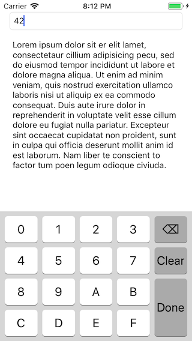

# Keypad
In-app Keyboard (inputView) example

If you noticed this note...
https://developer.apple.com/library/content/documentation/General/Conceptual/ExtensibilityPG/CustomKeyboard.html

> BEFORE YOU BEGIN
>
> Make sure a custom, systemwide keyboard is indeed what you want to develop. To provide a fully custom keyboard for just your app or to supplement the system keyboard with custom keys in just your app, the iOS SDK provides other, better options. Read about custom input views and input accessory views in Custom Views for Data Input in Text Programming Guide for iOS.

And wanted an example of how you might set up a custom keyboard for just your app, here it is.

Bonuses...
- Keyboard buttons styled in Interface Builder, using IBInspectable
- Uses Notifications, so your text input views don't need to implement anything special
- Delete, Clear, and Done special key examples
- Swift 4

